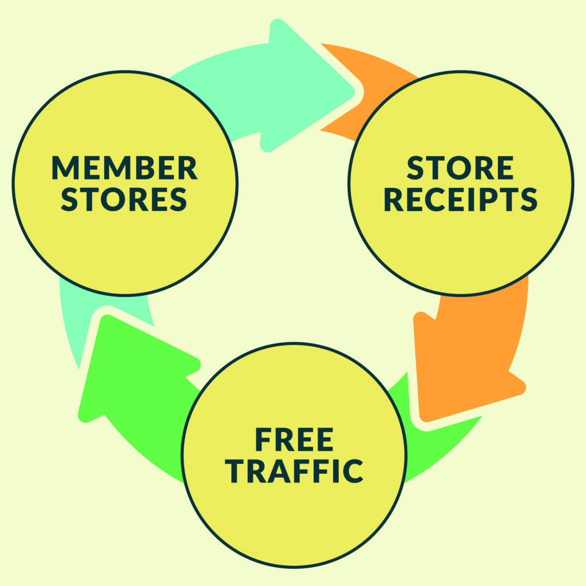

# Goodcarts

Contributors: GoodCarts
Tags: WooCommerce, woo, e-commerce, ecommerce, free, traffic, marketing, promotion, coupons, discounts, sales, store  
Requires at least: 5.5
Tested up to: 5.8
Requires PHP: 7.0
Stable tag: 1.0.0
License: GPLv3
License URI: https://www.gnu.org/licenses/gpl-3.0.html

## Banner Image

GoodCarts is a free traffic plugin for ecommerce retail stores on WooCommerce. Post-purchase cross-promotion delivers new customer sales at no cost.

## Description

GoodCarts is the free post-purchase engine that gets your ecommerce brand discovered.

Choose the “circle” that best describes your ecommerce business and receive free traffic from other GoodCarts network stores in your circle (Shop-for-Good/sustainability, Made in the USA, small business entrepreneurs, etc.) 

We uniquely “recycle” post-purchase customer traffic with a customized page of discount offers from participating ecommerce retailers and DTC brands. Your store gets discovered for free.

## Simple Set Up in Minutes

Install the GoodCarts WordPress plugin designed to work with WooCommerce
Create your GoodCarts account from within the plugin and give it permissions to connect with WooCommerce when prompted.
Pick the “Circle” based on the best fit for your store.
Create your discount offer with images to convert our free marketing into new  customers. 
That’s it, all other settings, such as editing your Thank You banner, are optional. 

Try it to see just how quickly your discount offer and featured product image attracts free traffic and paying customers. There is no lock-in! 

GoodCarts’ one year retention rate for our member stores is more than 90% with our Shop-for-Good circle of brands. Why? GoodCarts members enjoy an average of more than 10% discount offer redemption rate. 

### For More

See [GoodCarts.co/woocommerce](https://GoodCarts.co/woocommerce) and our general GoodCart.co for more details. We serve multiple ecommerce platforms, so the first link is your best WordPress/WooCommerce specific advice.

When a customer makes a purchase from your ecommerce store, a modest Thank You banner is displayed on your “Thank You/Order Received” WooCommerce page. This allows consumers -- credit cards out and ready to purchase -- to discover and shop from other stores in the GoodCarts network. You can ensure your direct competitors are not displayed. Just as you’re “recycling” traffic to other stores in the GoodCarts network, they are “recycling” traffic to your store. 

In the future, GoodCarts will offer premium options including featured discounts and additional traffic opportunities. 

### Video Demo

See how GoodCarts works from a customer’s perspective.

https://www.youtube.com/watch?v=KB85JGOWIV0

## Frequently Asked Questions ==

### What kinds of stores will your store cross-promote?

GoodCarts connects stores in “Circles” based on themes like shop-for-good/sustainable products, Made in USA, Black-owned, Premium DTC, and a wider Founders Circle for small businesses. We carefully review stores to make sure they are in the best fit circle..

### What kinds of stores aren’t allowed?

None of the GoodCarts Circles allow stores selling adult/mature products, alcohol, weapons, etc. Only the Founders Circle for everyday small business retailers accepts stores that dropship products from outside of their home continent.

### Can my store join from anywhere?

Our initial focus is on stores that ship standard to the United States. Additional Circles are planned for other parts of the world. [Contact us](https://goodcarts.co/contact) and ask to  join a waiting list for your part of the world.

### Is “Free” too good to be true?

It is both good AND true! GoodCarts is powered by reciprocity - all members in our network present their post-checkout customers the opportunity to view discounts from other brands in the same Circle. By recycling your post-purchase traffic, you’re earning  free exposure and traffic in return. 

### Can I choose which stores to cross-promote?

Yes, once you are approved into your Circle, find the Blocklist feature under More Options. This  allows you to pick stores with whom you DO NOT wish to share traffic. It is typically used to avoid promoting a direct competitor. 

For more answers to questions, see the [FAQ on our website](https://goodcarts.co/faq).

## Screenshots

1. 
GoodCarts “recycles” post-purchase traffic into new customers for your store 
2. Simple “Thank You Banner” appears across all our member store’s receipts - high CTR powers the discovery of your store by new customers
3. Sample discount page with other offers from stores in your “Circle” 
4. Activate the GoodCarts plugin
5. Create your store’s GoodCarts account or login if you have one
6. Connect GoodCarts to your WooCommerce plugin
7. Select the Circle where you have the best bit (all stores are reviewed and approved to best circle - per the FAQ, no Adult/Mature product stores are served by GoodCarts)
8. Creating your discount offer is the CRUCIAL step - use a great product image
9. Send traffic to your homepage or a dedicated page 
10. Optional - Customize your Thank You Banner text, button color and text
11. Main Dashboard - What you will see after you finish setup
12. Optional - Blocklist - Once your store is approved you may block your exiting customers from seeing offers from direct competitors (which blocks your’s from being seen from them as well)

## Installation

### Minimum Requirements

* WooCommerce 4.5 or higher including 5.8
* WordPress 5.5 to 5.8 have been tested with WooCommerce versions above

### Automatic Installation

Automatic installation is the easiest -- WordPress handles the file transfer, and you won’t leave your web browser. For an automatic install of GoodCarts, log in to your WordPress dashboard, navigate to the Plugins menu, and click ‘Add New’
 
In the search field type ‘GoodCarts’, then click ‘Search Plugins’. Once you've found us,  you can install it by clicking ‘Install Now’, and WordPress will take it from there.

Activate the GoodCarts plugin and then go to the admin / GoodCarts section and follow the instructions. 

### Manual Installation

Manual installation method requires downloading the GoodCarts plugin [here](https://github.com/Warecorp/goodcarts-wp-plugin/archive/refs/heads/main.zip) and uploading it to your web server via your favorite FTP application. The WordPress codex contains [instructions on how to do this here](https://wordpress.org/support/article/managing-plugins/#manual-plugin-installation).

1. Unzip the plugin you downloaded and upload the “goodcarts” folder to your ‘wp-content/plugins’ directory
2. Activate the plugin through the Plugins menu in WordPress
3. Then go to the admin / GoodCarts section and follow the instructions.

### Updating 

Automatic updates should work smoothly, but we recommend that you backup your site.

## Changelog
### 1.0
* Initial release
